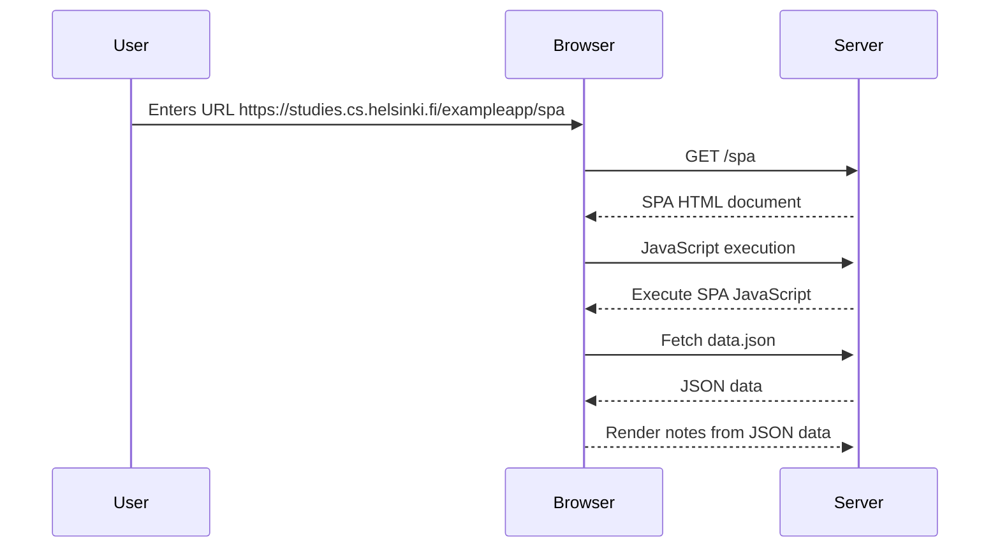
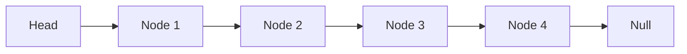
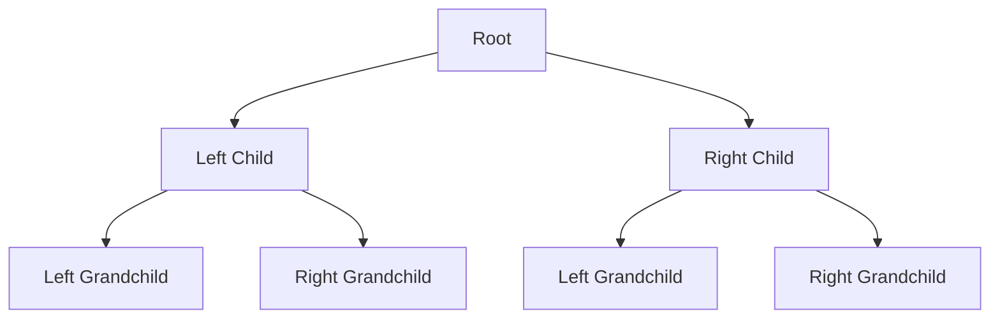

a test for fullstackopen



testing other graphs 





```mermaid

graph TD;
    A[Sorted Array] --> B(Start)
    B --> C{Find middle element}
    C -->|Equal| D(Return middle index)
    C -->|Less| E(Search left half)
    C -->|Greater| F(Search right half)
    E -->|Empty subarray| G(Return not found)
    F -->|Empty subarray| H(Return not found)
    E --> C
    F --> C

    %% Add titles to each node
    style A fill:#f9f,stroke:#333,stroke-width:4px;
    style B fill:#f9f,stroke:#333,stroke-width:4px;
    style C fill:#f9f,stroke:#333,stroke-width:4px;
    style D fill:#f9f,stroke:#333,stroke-width:4px;
    style E fill:#f9f,stroke:#333,stroke-width:4px;
    style F fill:#f9f,stroke:#333,stroke-width:4px;
    style G fill:#f9f,stroke:#333,stroke-width:4px;
    style H fill:#f9f,stroke:#333,stroke-width:4px;

    ```


